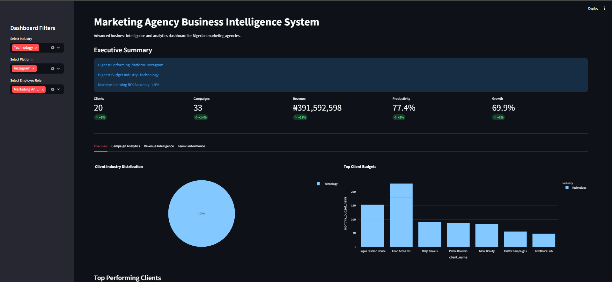
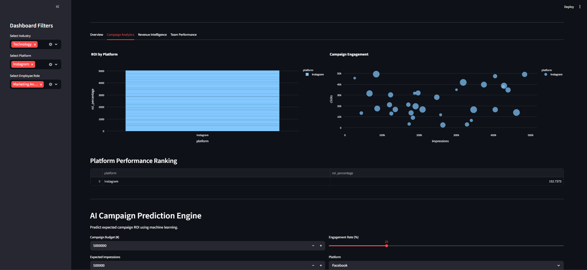

# Marketing Agency Business Intelligence System

An advanced business intelligence and analytics dashboard designed for Nigerian marketing agencies.

This platform combines data analytics, machine learning, interactive visualizations, and campaign intelligence to help agencies monitor performance, analyze revenue trends, evaluate employee productivity, and predict campaign ROI.

---

# Dashboard Preview

## Executive Dashboard



## Campaign Analytics



---

# Project Overview

Marketing agencies manage multiple campaigns, clients, platforms, and teams simultaneously. Monitoring campaign performance manually becomes increasingly difficult as operations scale.

This project simulates a real-world business intelligence platform capable of:

- Monitoring campaign performance
- Tracking revenue growth
- Evaluating employee productivity
- Analyzing client industries
- Comparing advertising platforms
- Predicting campaign ROI using machine learning

The system was designed specifically around the operational structure of modern Nigerian marketing agencies.

---

# Key Features

## Executive Dashboard
- KPI summary metrics
- Revenue monitoring
- Productivity tracking
- Campaign performance overview
- Growth indicators

## Campaign Analytics
- ROI analysis by platform
- Engagement performance visualization
- Platform ranking tables
- Campaign performance comparisons

## Revenue Intelligence
- Monthly revenue growth analysis
- Profit trend visualization
- Business growth monitoring

## Team Performance Analytics
- Employee productivity analysis
- Task completion tracking
- Team performance visualization

## Machine Learning Prediction Engine
Predict expected campaign ROI using:
- Campaign budget
- Impressions
- Clicks
- Engagement rate
- Advertising platform

## Downloadable Reports
- Export campaign analytics reports as CSV files

---

# Machine Learning Model

The project uses:

- Linear Regression
- Label Encoding
- Train/Test Split Validation
- R² Accuracy Evaluation

The model predicts campaign ROI using historical campaign performance data.

---

# Tech Stack

- Python
- Streamlit
- SQLite
- Pandas
- Plotly
- Scikit-learn
- NumPy

---

# Project Structure

```text
marketing-agency-business-intelligence-system/
│
├── assets/
├── datasets/
│   ├── campaigns.csv
│   ├── clients.csv
│   ├── employees.csv
│   └── revenue.csv
│
├── screenshots/
│
├── agency_data.db
├── app.py
├── database.py
├── generate_dataset.py
├── main.py
├── README.md
└── requirements.txt
```

---

# Run Project Locally

## 1. Install Dependencies

```bash
pip install -r requirements.txt
```

## 2. Start the Dashboard

```bash
streamlit run app.py
```

---

# Dashboard Modules

## Overview
- Industry distribution analysis
- Top client budget insights
- Client ranking tables

## Campaign Analytics
- Platform ROI comparisons
- Engagement analytics
- Campaign performance ranking

## Revenue Intelligence
- Revenue growth tracking
- Profit analysis
- Business trend insights

## Team Performance
- Productivity analytics
- Team efficiency visualization
- Employee workload analysis

---

# AI Business Insights

The system automatically identifies:
- Highest performing advertising platforms
- Highest budget client industries
- Campaign performance trends
- ROI prediction insights

---

# Sample Use Cases

This platform can be adapted for:
- Marketing agencies
- Digital media firms
- Advertising consultancies
- Social media agencies
- Growth marketing startups
- Business intelligence demonstrations

---

# Future Improvements

Planned future upgrades include:

- Real-time API integrations
- Client authentication system
- Automated PDF reports
- AI recommendation engine
- Forecasting dashboards
- Real-time campaign monitoring
- PostgreSQL integration
- Cloud deployment optimization

---

# Author

Matthew Obayemi

Computer Science Student  
University of the People

---

# License

This project demonstrates the practical application of machine learning, business intelligence, interactive analytics, and dashboard engineering in solving real-world agency reporting and campaign analysis challenges.

